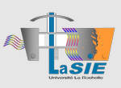
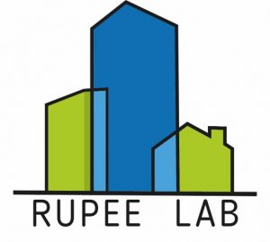

# Pymdu (Python Urban Data Model)

Pymdu (Urban Data Model) is a Python package designed to collect, post-process, model, and analyze urban data. It draws
inspiration from and reuses tools like [GeoClimate][4], [UWG][3], [UMEP-DEV][2], [t4gpd][1], and [pythermalcomfort][5]
to offer a complete
solution for urban environmental analysis. A key application of pymdu is outdoor thermal comfort analysis, enabling the
simulation and optimization of urban spaces to improve the well-being of residents.


## Documentation :

https://rupeelab17.github.io/pymdu/

## Installation :

https://rupeelab17.github.io/pymdu/installation/

## Citations :

If you reuse or adapt any of the work from this GitHub repository, please ensure to properly cite this reference. Proper
attribution helps maintain the integrity of the original work and supports the contributors.
Thank you!

```Martinez, S., Vellei, M., Rendu, M., Brangeon, B., Griffon, C., & Bozonnet, E. (2025). A methodology to bridge urban shade guidelines with climate metrics. Sustainable Cities and Society, 124``` [link][6]

```Martinez, S., Bozonnet, E., Rendu, M., & Brangeon, B. (2024). Modèle de données urbain pour l’étude de la surchauffe des quartiers.``` [link][7] 


[1]: https://github.com/thomas-leduc/t4gpd

[2]: https://github.com/UMEP-dev/UMEP

[3]: https://urbanmicroclimate.scripts.mit.edu/umc.php

[4]: https://github.com/orbisgis/geoclimate

[5]: https://github.com/CenterForTheBuiltEnvironment/pythermalcomfort

[6]: https://www.sciencedirect.com/science/article/pii/S2210670725001994?via%3Dihub

[7]: https://hal.science/EC-NANTES/hal-04599209v1

## Funding
  

This project has received funding from the France Relance program under the agreement number ANR-21-PRRD-0010-01. This project is supported by funding granted to the Tipee Platform as part of the LRZTC project / Operation 3.1.1 (Programme d'Investissements d'Avenir) by the Banque des Territoires. 
We acknowledge the support provided for the development and implementation of this work.




